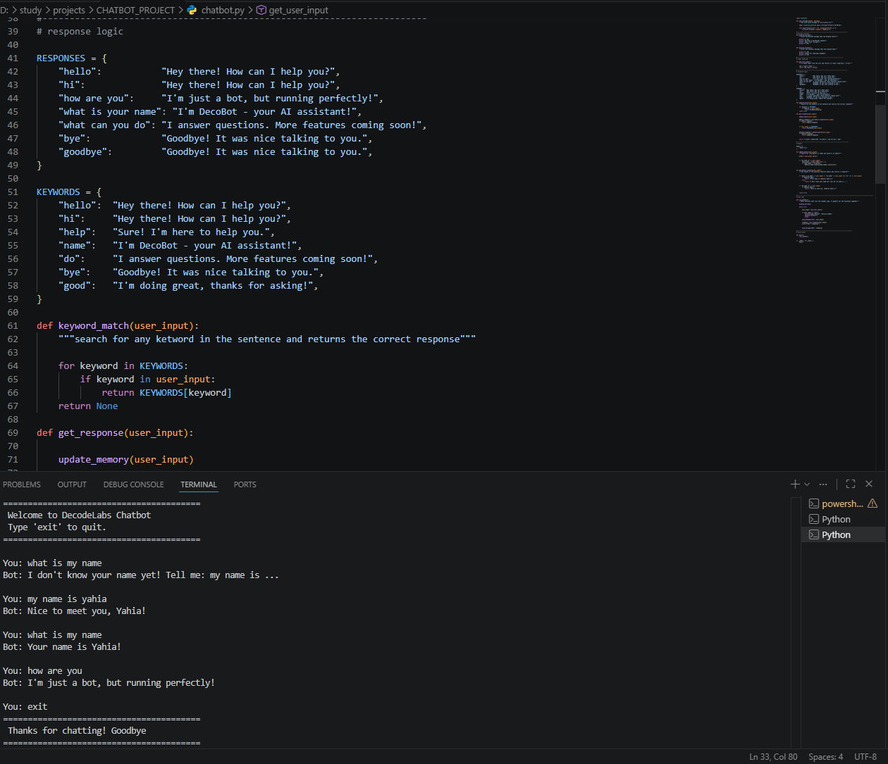

# Sentiment Analysis System 🎯

> Project 4 — DecodeLabs Industrial Training | Batch 2026

A rule-based sentiment analysis system that analyzes text and classifies it as Positive, Negative, or Neutral using lexicon-based scoring with negation handling and intensifier detection.

---

## Results

| Text | Sentiment | Score | Confidence |
|------|-----------|-------|------------|
| The product is amazing | POSITIVE 😊 | +2.00 | 40.0% |
| This is absolutely terrible | NEGATIVE 😞 | -4.00 | 80.0% |
| The service was not bad at all | POSITIVE 😊 | +1.00 | 20.0% |
| Very disappointing experience | NEGATIVE 😞 | -1.50 | 30.0% |
| I really enjoyed it | POSITIVE 😊 | +1.50 | 30.0% |


---
## Results Screenshot



---


## Project Structure

```
SENTIMENT_PROJECT/
├── sentiment_analyzer.py   # Main analysis engine
├── lexicon.py              # Sentiment word dictionary
├── results.json            # Auto-generated batch results
├── requirements.txt        # Dependencies
├── .gitignore              # Files to ignore
└── README.md               # Documentation
```

---

## Pipeline

```
INPUT          PROCESS                        OUTPUT
──────────     ──────────────────────────     ──────────────────
Raw Text   →   1. Lowercase + Clean       →   Sentiment Label
               2. Tokenize                    (Positive /
               3. Score Words                  Negative /
               4. Handle Negation              Neutral)
               5. Apply Intensifiers       +  Confidence Score
               6. Calculate Total          +  JSON Export
```

---

## Key Features

- Single text analysis
- Batch analysis with statistics
- Negation handling ("not bad" = Positive)
- Intensifier detection ("absolutely terrible" = -4.0)
- JSON export of results
- Debug mode for word-level analysis

---

## How to Run

```bash
# 1. Clone the repo
git clone https://github.com/your-username/sentiment-project.git

# 2. Navigate to folder
cd sentiment-project

# 3. Run the analyzer
python sentiment_analyzer.py
```

---

## Example Output

```
==================================================
   SENTIMENT ANALYSIS SYSTEM
==================================================

You: The product is amazing
--------------------------------------------------
  Text       : The product is amazing
  Sentiment  : POSITIVE 😊
  Score      : 2.00
  Confidence : 40.0%
--------------------------------------------------
```

---

## Scoring System

```
+2.0  →  Strong Positive  (amazing, excellent)
+1.0  →  Medium Positive  (good, great)
+0.5  →  Weak Positive    (okay, fine)
 0.0  →  Neutral
-0.5  →  Weak Negative    (mediocre, boring)
-1.0  →  Medium Negative  (bad, poor)
-2.0  →  Strong Negative  (terrible, horrible)
```

---

## Key Concepts

| Concept | Implementation |
|---------|---------------|
| Lexicon-Based Analysis | Dictionary of weighted words |
| Negation Handling | Flip score on "not/never/no" |
| Intensifier Detection | Multiply score by weight |
| Batch Processing | Analyze multiple texts at once |
| JSON Export | Save results with timestamp |

---

## Author

**Yaya** — NLP Engineer & AI Graduate
Faculty of Artificial Intelligence, Kafr El-Sheikh University (2023)

---

## License

MIT License
